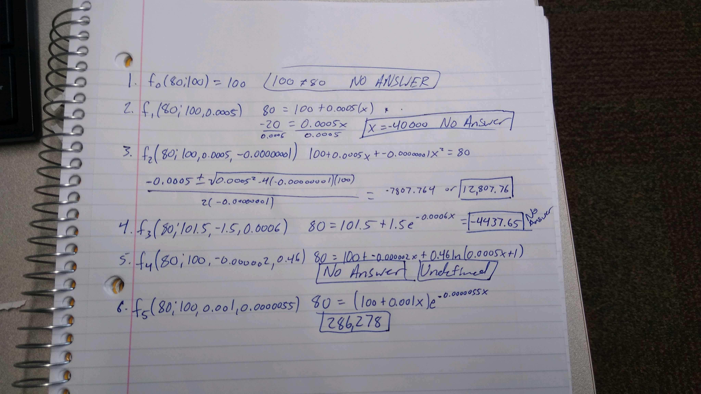

```{r setup, include=FALSE}
knitr::opts_chunk$set(echo = TRUE)
```

## Function 1

The first function is $f_0(t;a_0)=a_0$. Since $a_0$ is $a_0 = 101$, if you try and plug in an intensity of 80 and solve for x you do not get an answer because $80 \neq 100$.

This would be an incorrect assumption about LED bulbs because they are not able to have the same intensity forever.

## Function 2

The second function is $f_1(t;a_0,a_1) = a_0 + a_1t$ with parameters $a_0 = 100$ and $a_1 = 0.0005$. If the x-axis is not extended beyond 0 in the negative direction, then we do not get an answer. If we do we can use uniroot and get the following answer:

```{r}
uniroot(function(x){20 + 0.0005 * x}, c(-41000,-39000))$root
```

This is an incorrect assumption because you can't have -400000 hours.

## Function 3

The third function is $f_2(t;a_0,a_1,a_2) = a_0 + a_1t+a_2t^2$ with the parameters $a_0 = 100$, $a_1 = 0.0005$, and $a_2 = -0.00000001$. When we perform a uniroot on the function, we get the following value:

```{r}
uniroot(function(x){20 + 0.0005 * x + -0.00000001 * x^2}, c(70000,100000))$root
```

This prediction may be a possibility, but it suggests that the lightbulb intensity will only decrease 20% for the first 8.8 years of its life.

## Function 4

The fourth function is $f_3(t;a_0,a_1,a_2) = a_0 + a_1e^{-a_2t}$ with the paramaters $a_0 = 101.5$, $a_1 = -1.5$, and $a_2 = 0.0006$. The uniroot for this function is the following value:

```{r}
uniroot(function(x){21.5 + -1.5 * exp(-0.0006 * x)}, c(-100000,100000))$root
```

Again this is an incorrect assumption, because you can't have a lightbulb run -4,438 hours.

## Function 5

The fifth function is $f_4(t;a_0,a_1,a_2) = a_0 + a_1t+a_2ln(0.005t + 1)$ with the paramaters $a_0 = 100$, $a_1 = -0.000002$, and $a_2 = 0.46$. The uniroot for this function cannot be calculated because there is not a positive value that crosses 80%. This is an incorrect assumption because this assumes that there is no intensity decline over the lifetime of the lightbulb.

## Function 6

The last function is $f_5(t;a_0,a_1,a_2) = (a_0 + a_1t)e^{-a_2t}$ with the paramaters $a_0 = 100$, $a_1 = -0.001$, and $a_2 = 0.0000055$. The uniroot for this function is the following value:

```{r}
uniroot(function (x) {((100 + 0.001*x)*exp(-0.0000055 * x)) - 80}, c(0,500000))$root
```

This function is less likely than function 3 because it suggests that the intensity of the lightbulb will only decrease to 80% after the first 33 years of the lightbulb's life.

## Image of hand calculations


