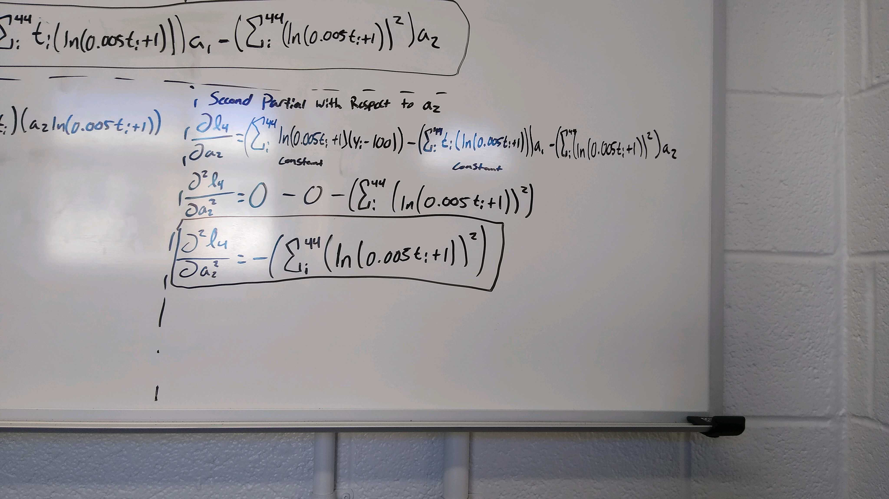
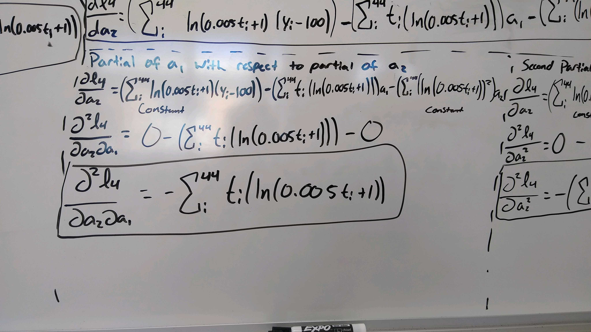

```{r setup, include=FALSE}
knitr::opts_chunk$set(echo = TRUE)
```

In this project we will take the derivatives and partial derivatives of a few of these likelihood functions. All of these were done on a whiteboard and their images are attached.

## Likelihood Function 1

The first derivative of this function is as follows:


The second derivative of this function is as follows:


## Likelihood Function 4

This function is in 5 parts because there are two variables. As a result a partial and second partial is performed for both $a_1$ and $a_2$ as well as a partial of $a_1$ with respect to $a_2$.

The first partial with respect to $a_1$ is the following:


The first partial with respect to $a_2$ is the following:


The second partial with respect to $a_1$ is the following:


The second partial with respect to $a_2$ is the following:



And finally, the partial of $a_1$ with respect to the partial of $a_2$ is the following:



## Likelihood Function 5

For this function both a first and second derivative were taken with repect to $a_1$. Both are given in the image below:

