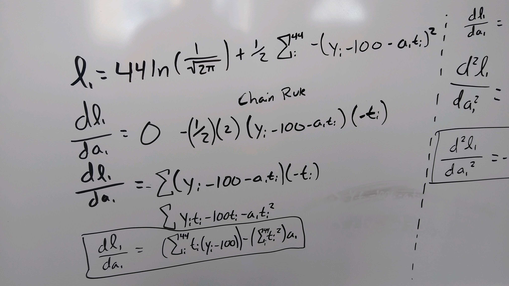
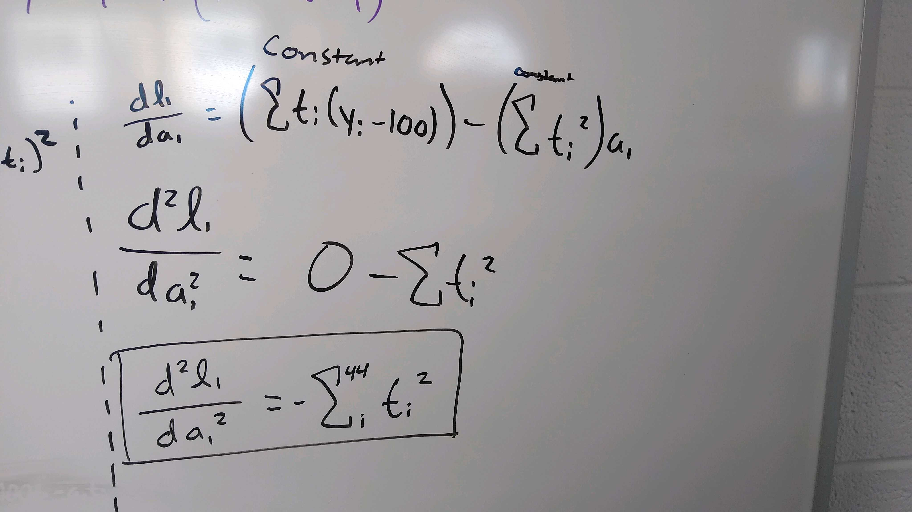
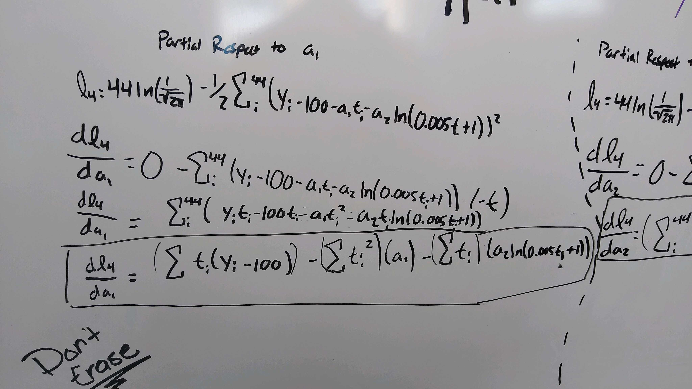
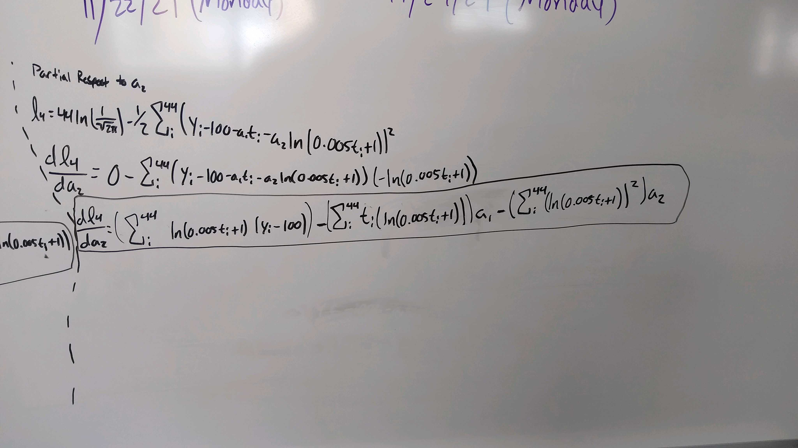
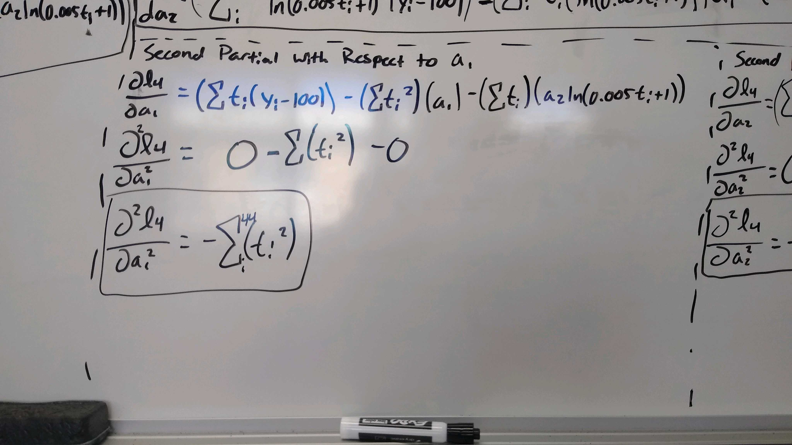
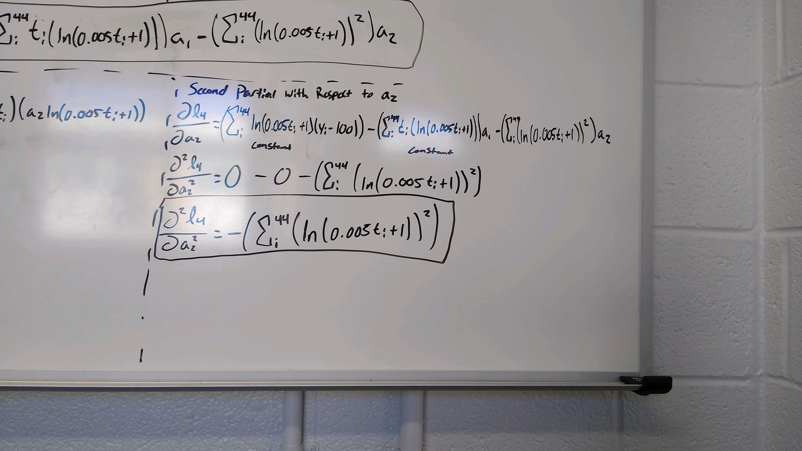

```{r setup, include=FALSE}
knitr::opts_chunk$set(echo = TRUE)
```

```{r}
#If needed, refer to Project 1 Task 1 to install the data4led package.
library(data4led)

#Change the DDDD below to your assigned seed, and then load the data for that randomly selected bulb. 
#This is part of what makes your work reproducible.
bulb <- led_bulb(1,seed = 7098)
```

## Maximum Likelihood Method for Function 1

We will consider the model $f_1(t; a_1) = 100 + a_1t$. The loglikelihood for this function will be as follows:

$$\ell_1(a_1; \mathbf{t}, \mathbf{y}) = 44\ln(\frac{1}{\sqrt{2\pi}}) + -\frac{1}{2}\sum_i^{44}-(y_i - 100-a_1t_i)^2$$

We want to find the maximum of $\ell_1$ so we will take the derivative with respect to $a_1$. This was done with the following hand calculation:



To find the critical point we will set the derivative equal to 0 and solve for $a_1$. When it is simplified we get the following function:

$$a_1 = \frac{\sum{y_i-100}}{\sum{t_i}}$$

```{r}
t <- bulb$hours
y <- bulb$percent_intensity

a1 <- sum(y - 100) / sum(t)
```

When we plug it into R we get a critical point of $0.0004728455$. We can now do the second derivative test to calculate whether this is a local minima or maxima. The following image shows the calculation for the second derivative:



```{r}
-sum(t^2)
```

We get $-328,767,530$ for the second derivative test, so we know that we have a maximum.

We will now fit it visually:

```{r}
f1 <- function(x,a1=0){
  100 + a1*x
}

x <- seq(-10,80001,2)
par(mfrow=c(1,2),mar=c(2.5,2.5,1,0.25))
plot(t,y,xlab="Hour ", ylab="Intensity(%) ", pch=16,main='f1')
lines(x,f1(x,a1),col=2)
plot(t,y,xlab="Hour ", ylab="Intensity(%) ", pch=16, xlim = c(-10,80000),ylim = c(-10,120))
lines(x,f1(x,a1),col=2)

```

## Maximum Likelihood Method for Function 4

We will consider the model $f_4(t; a_1,a_2) = 100 + a_1t + a_2\ln(0.005t+1)$. The log likelihood function for this model is as follows:

$$\ell(R) = 44\ln(\frac{1}{\sqrt{2\pi}})  -\frac{1}{2}\sum_i^{44}(100 + a_1t + a_2\ln(0.005t+1))^2$$

We want to find the maximum of $\ell_4$ so we will take the partial derivative with respect to $a_1$ and $a_2$. This was done with the following hand calculations:





We notice that these functions appear to take the following form:

$$
\left\{
\begin{align*}
b_1 - c_{11}a_1 - c_{12}a_2 &= 0 \\ 
b_2 - c_{21}a_1 - c_{22}a_2 &= 0,
\end{align*} 
\right.
$$

We will calculate and store the variables:

```{r}
c.11 <- sum(t^2)
c.12 <- sum(t * (log(0.005*t+1)))
c.22 <- sum(log(0.005*t+1)^2)
c.21 <- sum(t * log(0.005 * t +1))
b.1 <- sum((y-100)*t)
b.2 <- sum(log(0.005 * t + 1) * (y - 100))
```

Using this form we can calculate $a_2$ and $a_1$:

$$a_2 = \frac{c_{11}b_2 - c_{12}b_1}{c_{11}c_{22} - c_{12}^2}\text{ and }a_1 = \frac{b_1 - c_{12}a_2}{c_{11}}.$$

We have an $a_1$ value as follows:
```{r}
best.a2 <- (c.11*b.2 - c.12*b.1)/(c.11*c.22 - c.12^2) 
best.a1 <- (b.1 - c.12*best.a2)/c.11 

best.a1
```


And an $a_2$ value as follows:

```{r}
best.a2
```






We can do the second derivative test and confirm that these are maximum values with the following function:

$$D = \left(\frac{\partial^2\ell_4}{\partial a_1^2}\right)\left( \frac{\partial^2\ell_4}{\partial a_2^2}\right) - \left(\frac{\partial^2\ell_4}{\partial a_2 \partial a_1}\right)^2 = \left(- \sum_{i=1}^{44}t_i^2\right)\left(- \sum_{i=1}^{44}\ln(0.005t_i+1)^2\right) - \left(- \sum_{i=1}^{44}t_i(\ln(0.005t_i + 1))\right)^2.$$

```{r}
D <- (-c.11)*(-c.22) - (c.21)^2
D
```

The second partial with respect to $a_1$ twice

```{r}
-c.11
```

Because D is greater than 0 and $\frac{\partial^2\ell_2}{\partial a_1^2}$ < 0 we know there is a maximum. As a result, the best fit model will be:

$$f_2(t) = 100 + -5.406846e-05t + 0.5302281\ln(0.005t+1)$$

We will graph it to confirm that it fits visually:

```{r}
f4 <- function(x,a0=0,a1=0,a2=1){
  a0 + a1*x + a2*log(0.005*x+1)
}

a0 <- 100
a1 <- best.a1
a2 <- best.a2

x <- seq(-10,80001,2)
par(mfrow=c(1,2),mar=c(2.5,2.5,1,0.25))
plot(t,y,xlab="Hour ", ylab="Intensity(%) ", pch=16,main='f4')
lines(x,f4(x,a0,a1,a2),col=2)
plot(t,y,xlab="Hour ", ylab="Intensity(%) ", pch=16, xlim = c(-10,80000),ylim = c(-10,120))
lines(x,f4(x,a0,a1,a2),col=2)
```

## Maximum Likelihood Method for Function 5

We will consider the model $f_5(t; a_1) = 100e^{-0.00005t} + a_1te^{-0.00005t}$. The log likelihood function for this model is as follows:

$$\ell_5(a_1; \mathbf{t},\mathbf{y}) = 44\ln\left(\frac{1}{\sqrt{2\pi}}\right) - \frac{1}{2}\sum_{i}^{44} (y_i - 100e^{-0.00005t_i} - a_1t_ie^{-0.00005t_i})^2$$

We want to find the maximum of $\ell_5$ so we will take the derivative with respect to $a_1$ and set it equal to 0. The derivative is as follows:

$$\frac{d\ell_5}{da_1} = \left(\sum_{i=1}^{44} t_ie^{-0.00005t_i}(y_i-100e^{-0.00005t_i})\right) - \left(\sum_{i=1}^{44} (t_ie^{-0.00005t_i})^2\right) a_1$$

When we do this, we get the following $a_1$ value.

```{r}
best.a1 <- sum((t * exp(-0.00005*t))*(y-100*exp(-0.00005*t))) / sum((t*exp(-0.00005*t))^2)
best.a1
```

 We can now do the second derivative test to calculate whether this is a local minima or maxima. The following is the second derivative of our function with respect to $a_1$:
 
$$\frac{d^2\ell_5}{da_1^2} = -\sum_{i=1}^{44} (t_ie^{-0.00005t_i})^2$$
 
```{r}
-sum((t*exp(-0.00005*t))^2)
```

Because we get a negative number we know that it must be a maximum.

We will now fit it visually as follows:

```{r}
f5 <- function(x,a0=0,a1=0,a2=1){
  a0*exp(-0.00005*x) + a1*x*exp(-0.00005*x)
}

a0 <- 100
a1 <- best.a1

x <- seq(-10,80001,2)
par(mfrow=c(1,2),mar=c(2.5,2.5,1,0.25))
plot(t,y,xlab="Hour ", ylab="Intensity(%) ", pch=16,main='f5')
lines(x,f5(x,a0,a1,a2),col=2)
plot(t,y,xlab="Hour ", ylab="Intensity(%) ", pch=16, xlim = c(-10,80000),ylim = c(-10,120))
lines(x,f5(x,a0,a1,a2),col=2)
```

 