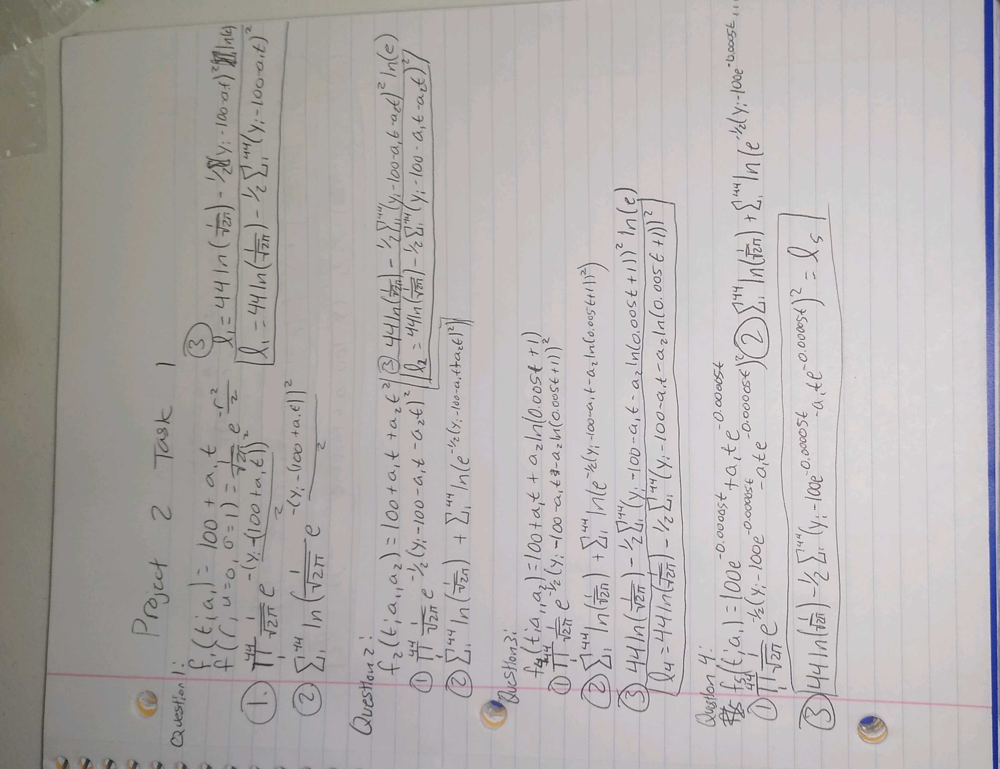
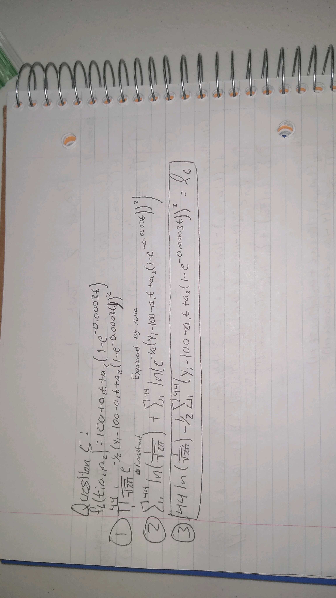

```{r setup, include=FALSE}
knitr::opts_chunk$set(echo = TRUE)
```

In this project I am going to talk about how we can for 5 functions to the loglikelihood function and simplify it in a way that it will be simple to differentiate later. The functions we are working with are as follows:

$f_1(t; a_1) = 100 + a_1t$

$f_2(t; a_1,a_2) = 100 + a_1t + a_2t^2$

$f_4(t; a_1,a_2) = 100 + a_1t + a_2\ln(0.005t+1)$

$f_5(t; a_1) = 100e^{-0.00005t} + a_1te^{-0.00005t}$

$f_6(t; a_1,a_2) = 100 + a_1t + a_2(1-e^{-0.0003t})$

I will step through the process of solving $f_1$, then I will share a picture of my work on each function.

## Function 1 Walkthrough

We know that the log likelihood function is the following, $f(r;u = 0, \sigma = 1) = \frac{1}{\sqrt{2\pi}}e^{\frac{-r^2}{2}}$, with r being the residual. We know that a residual is the difference between the y value of the observed point and the predicted y-value. so, we can rewrite the function as follows:

$$\ell_1 = \frac{1}{\sqrt{2\pi}}e^{\frac{-(y_i - 100-a_1t)^2}{2}}$$

Because we are looking at the likelihood of each point occurring we must multiply each of the likelihood together. So, now we get the following function:

$$\ell_1 =\prod_i^{44}(\frac{1}{\sqrt{2\pi}}e^{\frac{-(y_i - 100-a_1t_i)^2}{2}})$$

Differentiating this function would be a nightmare, so lets use some log rules to simplify the function. Because a product of logs is equivalent to the sum of logs we can wrap our function in a log and change it to a sum, which will make it easier to differentiate.

$$\ell_1 =\sum_i^{44}\ln(\frac{1}{\sqrt{2\pi}}e^{\frac{-(y_i - 100-a_1t_i)^2}{2}})$$

As mentioned previously, a product of logs is the same as the sum of logs. So, because we have a product within our log we can split it up into two sums:

$$\ell_1 =\sum_i^{44}(\ln(\frac{1}{\sqrt{2\pi}}) * \ln(e^{\frac{-(y_i - 100-a_1t_i)^2}{2}})) = \sum_i^{44}\ln(\frac{1}{\sqrt{2\pi}}) + \sum_i^{44}\ln(e^{\frac{-(y_i - 100-a_1t_i)^2}{2}})$$

Because our first log term is a constant we can just multiply it by the number of observations (in this case 44 which will be canceled out when we differentiate). We can also apply the log exponent rule in the second term to pull the exponent of $e$ out of the log. So, now our function looks as follows:

$$\ell_1 = 44\ln(\frac{1}{\sqrt{2\pi}}) + -\frac{1}{2}\sum_i^{44}-(y_i - 100-a_1t_i)^2\ln(e)$$

Finally, because the $\ln(e) = 1$, we can just remove that term and we are let with the following log likelihood function:

$$\ell_1 = 44\ln(\frac{1}{\sqrt{2\pi}}) + -\frac{1}{2}\sum_i^{44}-(y_i - 100-a_1t_i)^2$$

## Big picture

Because residuals are calculated the same way in a log likelihood function for all models with $yi - f(t)$ we can replace the residual term with a $r$ variable where $r$ is the vertical distance of the observed value from the model expected value. Here is a standardized function with R being the residual and O being the number of observations.

$$\ell(R, O) = O\ln(\frac{1}{\sqrt{2\pi}}) + -\frac{1}{2}\sum_i^{O}-(R)^2$$

## Solving all 5 Functions



